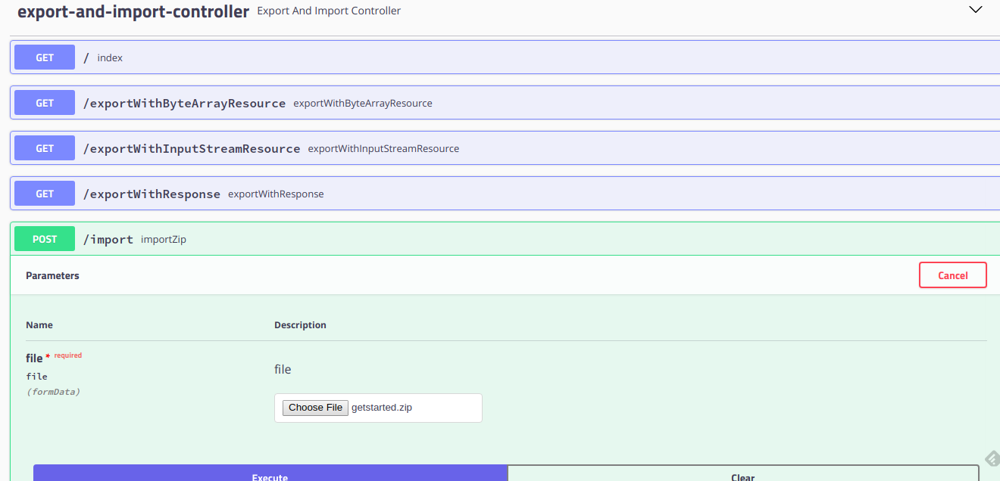

# export-import-zip-use-stream

不解压上传zip文件并读取内容，通过流下载zip文件


## 开始

下面说明怎样运行此项目并看到效果。首先克隆此项目：

```
git clone https://github.com/pulllock/export-import-zip-use-stream.git
```

### 运行

将Spring Boot项目导入到IDEA中，运行项目！

### 访问

[http://localhost:8080](http://localhost:8080)

## 构建

* [Maven](https://maven.apache.org/) - 依赖管理

## 贡献

暂无

## 作者

* **Pullock** - ** - [Pullock](https://github.com/pulllock)

## License

This project is licensed under the MIT License！